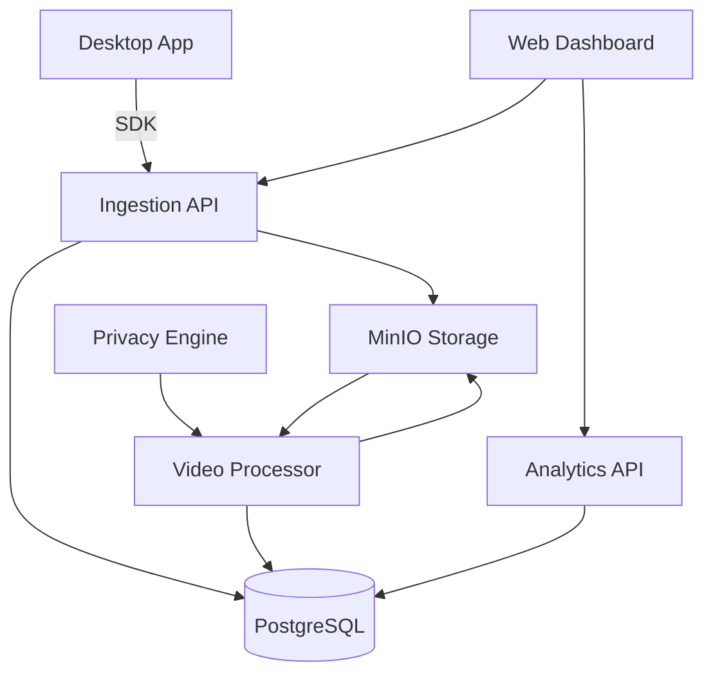

<div align="center">

> ⚠️ This project was built with heavy AI assistance using multiple coding agents.
> I directed the architecture and reviewed all changes, but did not write most of the code manually.
> Feedback and contributions welcome.

# 🔭 Chronoscope

**Session replay for desktop apps. Free. Open source. Self-hosted.**

[](https://opensource.org/licenses/MIT)
[](https://goreportcard.com/report/github.com/etherman-os/chronoscope)
[](https://github.com/etherman-os/chronoscope/actions)
[](https://github.com/etherman-os/chronoscope/blob/main/VERSION)

[Quick Start](#quick-start) • [Features](#features) • [Architecture](#architecture) • [Docs](docs/)

</div>

---

## What is Chronoscope?

Chronoscope is a **session replay infrastructure** for native desktop applications. It records your users' screens, clicks, and interactions — then lets you replay them like a video in your browser.

Built for teams who:
- Ship **macOS, Windows, or Linux** desktop apps
- Need to debug "how did the user get here?" support tickets
- Want session replay insights without sending screen recordings to a third-party cloud
- Care about **data privacy** (GDPR, HIPAA, enterprise security)

> Think of it as a DVR for your desktop app. You press "record" via SDK, and your support team watches the playback later.

---

## Features

- **Screen & Event Capture** — Frame-by-frame video + click/scroll/keyboard event tracking via native SDKs
- **Cross-Platform SDKs** — Swift (macOS/ScreenCaptureKit), C++20 (Windows/WinRT Graphics Capture), Rust (Linux/PipeWire & X11)
- **Privacy-First** — Automatic PII redaction (credit cards, emails, passwords) via on-device Rust privacy engine
- **Self-Hosted** — Runs entirely on your infrastructure. PostgreSQL + Redis + MinIO. No external SaaS dependency.
- **Real-Time Processing** — FFmpeg-powered video processor transcodes, deduplicates frames, and applies redactions asynchronously
- **Replay Dashboard** — React-based player with timeline scrubbing and event overlay
- **Analytics API** — Pre-computed heatmaps, funnel stages, and session statistics
- **GDPR Ready** — User data export, right-to-be-forgotten deletion, and audit logging endpoints
- **Production Hardened** — SHA-256 API key hashing, rate limiting, CORS restrictions, input validation, and CSP headers

---

## Architecture



**Flow:**
1. **Capture** — SDK records frames + events locally
2. **Ingest** — API receives chunks, stores metadata in PostgreSQL and video in MinIO
3. **Process** — Rust worker transcodes video, deduplicates frames, redacts PII
4. **Replay** — Web dashboard fetches processed video and events for playback
5. **Analyze** — Analytics API serves heatmaps, funnels, and session stats

See [docs/ARCHITECTURE.md](docs/ARCHITECTURE.md) for the full deep dive.

---

## Tech Stack

| Layer | Technology |
|-------|-----------|
| **Ingestion API** | Go 1.22 + Gin |
| **Analytics API** | Go 1.22 + Gin |
| **Video Processor** | Rust + FFmpeg + libav* |
| **Privacy Engine** | Rust (C ABI for cross-language FFI) |
| **Dashboard** | React 18 + Vite + TypeScript |
| **Landing Page** | Next.js 14 |
| **macOS SDK** | Swift + ScreenCaptureKit |
| **Windows SDK** | C++20 + WinRT Graphics Capture |
| **Linux SDK** | Rust + PipeWire / X11 |
| **Database** | PostgreSQL 16 |
| **Cache/Queue** | Redis 7 |
| **Object Storage** | MinIO (S3-compatible) |
| **Infra** | Docker Compose |

---

## Quick Start

Get a local instance running in **5 minutes**:

### Prerequisites

- Docker & Docker Compose
- Go 1.22+
- Node.js 20+
- Git

### 1. Clone & Start Infrastructure

```bash
git clone https://github.com/etherman-os/chronoscope.git
cd chronoscope
make up
```

This starts PostgreSQL, Redis, and MinIO in the background.

### 2. Start the APIs

```bash
# Terminal 1 — Ingestion API
cd services/ingestion
cp .env.example .env
go run cmd/server/main.go

# Terminal 2 — Analytics API
cd services/analytics
cp .env.example .env
go run cmd/server/main.go
```

### 3. Start the Dashboard

```bash
# Terminal 3 — Web UI
cd services/web
cp .env.example .env
npm install
npm run dev
```

Open [http://localhost:5173](http://localhost:5173) in your browser.

### 4. Verify with cURL

```bash
curl -X POST http://localhost:8080/v1/sessions/init \
  -H "X-API-Key: acad389951a6aa7659c8315a796f91e9" \
  -H "Content-Type: application/json" \
  -d '{"user_id":"user-123","capture_mode":"hybrid"}'
```

See [docs/QUICKSTART.md](docs/QUICKSTART.md) for the complete guide, including SDK embedding.

---

## SDK Quick Integration

Drop the SDK into your desktop app and start capturing in minutes:

**macOS (Swift):**
```swift
import Chronoscope

let endpoint = URL(string: "https://api.yourapp.com")!
let config = CaptureConfig(apiKey: "your-key", endpoint: endpoint)
await Chronoscope.shared.start(config: config)
// ... later ...
await Chronoscope.shared.stop()
```

**Windows (C++20):**
```cpp
#include <chronoscope/sdk.h>

chronoscope::CaptureConfig config{"your-key", "https://api.yourapp.com"};
auto session = chronoscope::Chronoscope::Instance()
    .StartSession(config, hwnd, nullptr);
// ... later ...
session->Stop();
```

**Linux (Rust):**
```rust
use chronoscope_sdk::{CaptureConfig, LinuxCapture};

let config = CaptureConfig::new("your-key", "https://api.yourapp.com");
let mut capture = LinuxCapture::new(config)?;
capture.start().await?;
// ... later ...
capture.stop().await?;
```

See [docs/SDK_INTEGRATION.md](docs/SDK_INTEGRATION.md) for full integration guides.

---

## Security

Security is not an afterthought. See [docs/SECURITY.md](docs/SECURITY.md) for the full policy.

Highlights:
- **API Key Hashing** — SHA-256 before database comparison
- **Project Isolation** — Cross-project session access is impossible
- **Rate Limiting** — Configurable per-API-key token bucket with automatic bucket cleanup
- **Input Validation** — Chunk size (2 MiB), chunk index (10,000), event batch (1,000) limits
- **PII Redaction** — Automatic credit card, email, password, and SSN detection in frames
- **CSP & CORS** — Strict headers, configurable origin allowlist
- **Audit Logging** — Every GDPR export/delete is logged

---

## Documentation

- [Quick Start](docs/QUICKSTART.md) — 5-minute local setup
- [Architecture](docs/ARCHITECTURE.md) — Data flow, DB schema, deployment topology
- [API Reference](docs/API.md) — REST endpoints with cURL examples
- [SDK Integration](docs/SDK_INTEGRATION.md) — Embed capture SDKs into your app
- [Deployment](docs/DEPLOYMENT.md) — Production Docker Compose, SSL, backups, monitoring
- [Security](docs/SECURITY.md) — Security policy and hardening checklist
- [Contributing](docs/CONTRIBUTING.md) — Development setup and PR process

---

## Roadmap

- [ ] Windows SDK CI build on `windows-latest` runner
- [ ] Real-time WebSocket streaming for live session preview
- [ ] Session search by user action ("show me users who clicked X")
- [ ] SAML/SSO support for dashboard authentication
- [ ] Prometheus metrics exporter for all services
- [ ] Electron SDK wrapper
- [ ] Mobile SDK (iOS/Android) experimental support

---

## Contributing

We welcome contributions! Please read [docs/CONTRIBUTING.md](docs/CONTRIBUTING.md) before opening a PR.

All commits use [Conventional Commits](https://www.conventionalcommits.org/) format.

---

## License

[MIT](LICENSE) © Chronoscope Contributors
