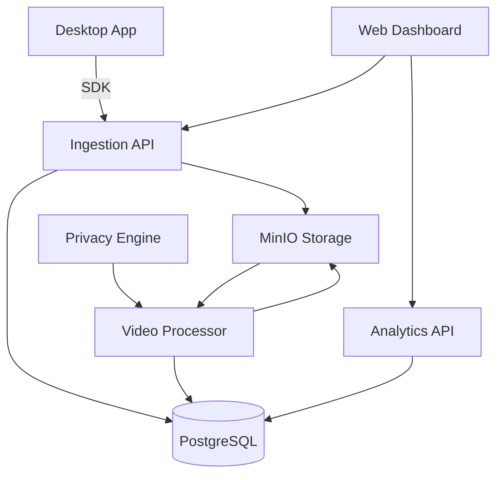

# Chronoscope

[](https://opensource.org/licenses/MIT)
[](https://goreportcard.com/report/github.com/etherman-os/chronoscope)
[](https://github.com/etherman-os/chronoscope/actions)

> **Session replay for desktop apps. Free. Open source. Self-hosted.**

---

## Quick Start

```bash
git clone https://github.com/etherman-os/chronoscope.git && cd chronoscope
make up                          # Start infrastructure
cd services/ingestion && cp .env.example .env && go run cmd/server/main.go
cd services/web && npm install && npm run dev
# Open http://localhost:3000
```

See [docs/QUICKSTART.md](docs/QUICKSTART.md) for the full 5-minute guide.

---

## Features

- :movie_camera: **Cross-platform capture** — macOS, Windows, Linux SDKs
- :arrows_counterclockwise: **Session replay** — video + event timeline overlay
- :bar_chart: **Analytics** — heatmaps, funnels, session stats
- :lock: **Privacy-first** — PII masking, GDPR export/delete, audit logs
- :rocket: **Self-hosted** — Docker Compose, single node or clustered

---

## Architecture



---

## Documentation

- [Quick Start](docs/QUICKSTART.md) — 5-minute setup
- [API Reference](docs/API.md) — REST endpoints and examples
- [Architecture](docs/ARCHITECTURE.md) — System design and data flow
- [Deployment](docs/DEPLOYMENT.md) — Production deployment guide
- [Security](docs/SECURITY.md) — Security policy and best practices
- [Contributing](docs/CONTRIBUTING.md) — Development setup and PR process

## Contributing

We welcome contributions! Please read [docs/CONTRIBUTING.md](docs/CONTRIBUTING.md) before opening a PR.

## License

[MIT](LICENSE) © Chronoscope Contributors
