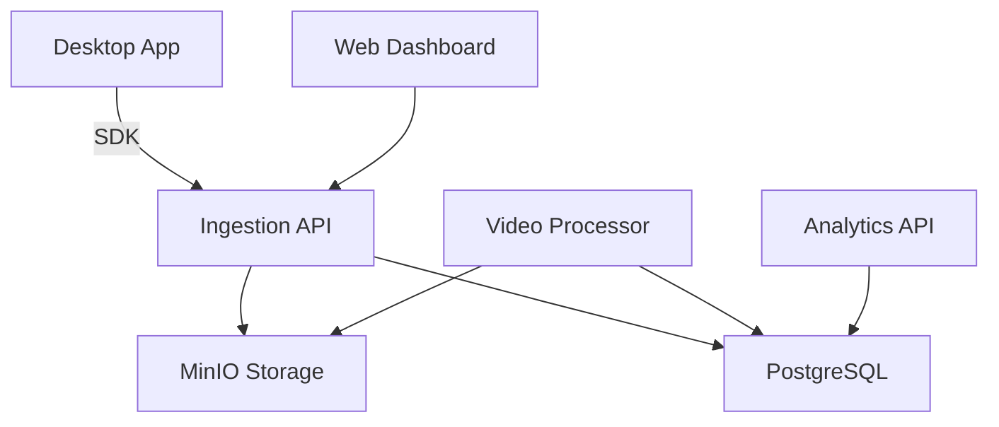

# Chronoscope

[](https://opensource.org/licenses/MIT)
[](https://golang.org/)
[](https://www.rust-lang.org/)

> **Session replay infrastructure for native desktop applications.**
> Free. Open source. Self-hosted.
> See every click. Fix every bug.

---

## What is Chronoscope?

Web apps have session replay (FullStory, PostHog, LogRocket). Desktop apps don't.

Chronoscope brings session replay to **macOS, Windows, and Linux** applications:
- Record user sessions with screen capture
- Replay sessions with event timeline overlay
- Analyze user behavior with heatmaps and funnels
- Stay compliant with built-in privacy and GDPR tools

## Architecture



## Quick Start

```bash
# Clone
git clone https://github.com/etherman-os/chronoscope.git
cd chronoscope

# Start infrastructure
make up

# Start backend
cd services/ingestion
cp .env.example .env
go run cmd/server/main.go

# Start analytics (optional)
cd services/analytics
cp .env.example .env
go run cmd/server/main.go

# Start frontend
cd services/web
npm install
npm run dev
```

## Features

### Capture SDKs
- **macOS**: Swift + ScreenCaptureKit (macOS 12.3+)
- **Windows**: C++20 + WinRT Graphics Capture API
- **Linux**: Rust + PipeWire (Wayland) / X11 SHM

### Backend
- **Ingestion API**: Go + Gin + PostgreSQL + MinIO
- **Video Processor**: Rust + FFmpeg + Perceptual Hash dedup
- **Analytics API**: Go + Gin + PostgreSQL aggregates

### Frontend
- **Replay Dashboard**: React + Vite + TypeScript + Canvas
- **Landing Page**: Next.js + Tailwind (static export)

### Privacy & Compliance
- PII detection (credit cards, emails, passwords)
- Real-time frame redaction (blur/blackout/replace)
- GDPR export and right-to-be-forgotten
- Audit logging

## Tech Stack

| Layer | Technology |
|-------|-----------|
| Capture | Swift, C++20, Rust |
| Backend | Go, Rust |
| Frontend | React, TypeScript, Next.js |
| Database | PostgreSQL |
| Storage | MinIO (S3-compatible) |
| Queue | Redis |
| Infra | Docker Compose |

## Directory Structure

```
Chronoscope/
├── packages/
│   ├── sdk-macos/       # Swift SDK
│   ├── sdk-windows/     # C++ SDK
│   └── sdk-linux/       # Rust SDK
├── services/
│   ├── ingestion/       # Go API
│   ├── processor/       # Rust video pipeline
│   ├── analytics/       # Go analytics API
│   ├── web/             # React dashboard
│   ├── landing/         # Next.js landing page
│   └── privacy-engine/  # Rust privacy library
├── protocols/           # OpenAPI + Protobuf
├── infrastructure/      # Docker, Helm
├── tools/
│   └── load-test/       # k6 scripts
└── migrations/          # PostgreSQL schema
```

## Contributing

See [docs/CONTRIBUTING.md](docs/CONTRIBUTING.md).

## License

MIT License — see [LICENSE](LICENSE) file.
