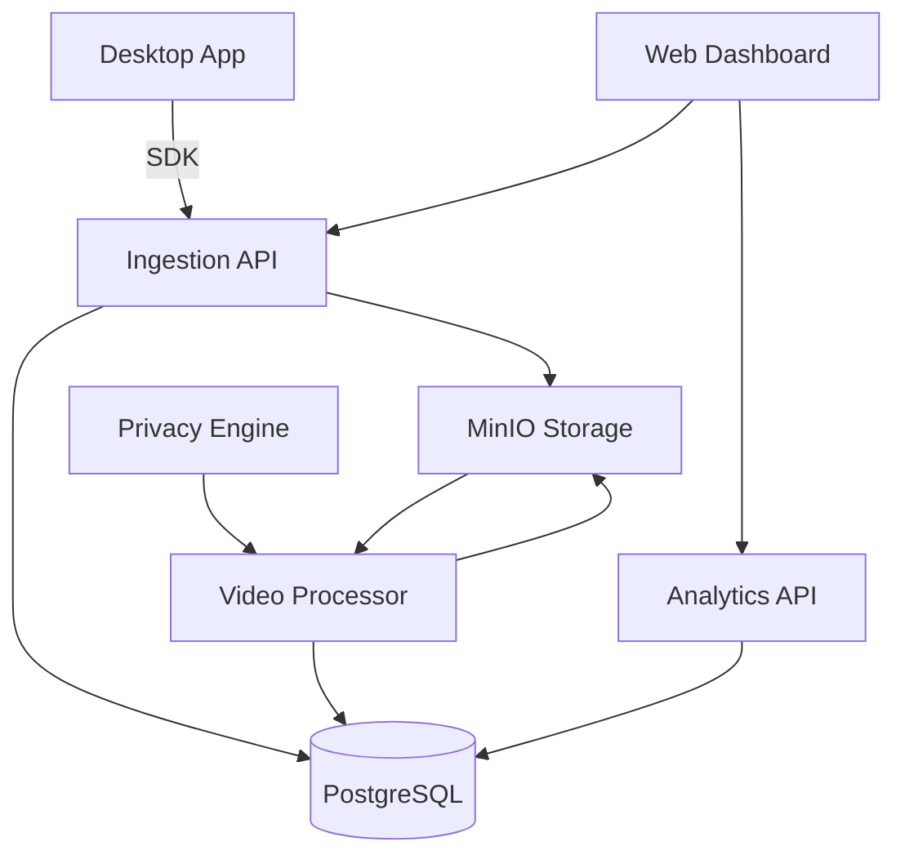

# Chronoscope

[](https://opensource.org/licenses/MIT)
[](https://goreportcard.com/report/github.com/etherman-os/chronoscope)
[](https://github.com/etherman-os/chronoscope/actions)

> **Session replay for desktop apps. Free. Open source. Self-hosted.**

---

## Quick Start

```bash
git clone https://github.com/etherman-os/chronoscope.git && cd chronoscope
make up                          # Start Postgres, Redis, MinIO
cd services/ingestion && go run cmd/server/main.go
```

Open the dashboard at `http://localhost:5173` after running `cd services/web && npm install && npm run dev`.

See [docs/QUICKSTART.md](docs/QUICKSTART.md) for the full 5-minute guide.

---

## Architecture



See [docs/ARCHITECTURE.md](docs/ARCHITECTURE.md) for detailed system design.

---

## Documentation

- [Quick Start](docs/QUICKSTART.md) — 5-minute local setup
- [Architecture](docs/ARCHITECTURE.md) — Data flow and component diagrams
- [API Reference](docs/API.md) — REST endpoints with cURL examples
- [SDK Integration](docs/SDK_INTEGRATION.md) — Embed capture SDKs
- [Deployment](docs/DEPLOYMENT.md) — Production Docker Compose and SSL
- [Security](docs/SECURITY.md) — Security policy and hardening
- [Contributing](docs/CONTRIBUTING.md) — Development setup and PR process

## Contributing

We welcome contributions! Please read [docs/CONTRIBUTING.md](docs/CONTRIBUTING.md) before opening a PR.

## License

[MIT](LICENSE) © Chronoscope Contributors
