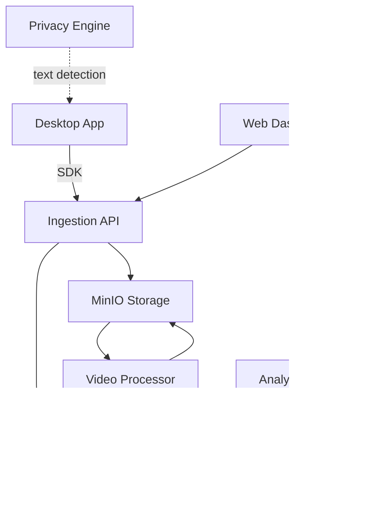

<div align="center">

# 🔭 Chronoscope

**Session replay for desktop apps. Free. Open source. Self-hosted.**

[](https://opensource.org/licenses/MIT)
[](https://goreportcard.com/report/github.com/etherman-os/chronoscope)
[](https://github.com/etherman-os/chronoscope/actions)
[](https://github.com/etherman-os/chronoscope/blob/main/VERSION)

[Quick Start](#quick-start) • [Features](#features) • [Architecture](#architecture) • [Docs](docs/)

</div>

---

## What is Chronoscope?

Chronoscope is a **session replay infrastructure** for native desktop applications. It records your users' screens, clicks, and interactions — then lets you replay them like a video in your browser.

Built for teams who:
- Ship **macOS, Windows, or Linux** desktop apps
- Need to debug "how did the user get here?" support tickets
- Want session replay insights without sending screen recordings to a third-party cloud
- Care about **data privacy** (GDPR, HIPAA, enterprise security)

> Think of it as a DVR for your desktop app. You press "record" via SDK, and your support team watches the playback later.

---

## Features

- **Screen & Event Capture** — Frame-by-frame video + click/scroll/keyboard event tracking via native SDKs
- **Cross-Platform SDKs** — Rust Linux/X11 recorder is the first working capture path; Swift macOS and C++20 Windows SDKs are beta/experimental until their full API lifecycle is verified
- **Privacy-First** — Text-level PII detection (credit cards, emails, passwords, SSN) via the Rust privacy engine; frame-level video redaction is on the roadmap
- **Self-Hosted** — Runs entirely on your infrastructure. PostgreSQL + Redis + MinIO (S3-compatible object storage). No external SaaS dependency.
- **Real-Time Processing** — FFmpeg-powered video processor transcodes and deduplicates frames asynchronously
- **Replay Dashboard** — React-based player with timeline scrubbing and event overlay
- **Analytics API** — Pre-computed heatmaps, funnel stages, and session statistics
- **GDPR Ready** — User data export, right-to-be-forgotten deletion, and audit logging endpoints
- **Production Hardened** — bcrypt/SHA-256 API key hashing (migration path), rate limiting, CORS restrictions, input validation, non-root service containers, health checks, and CSP headers

---

## Architecture


```mermaid
graph TD
    A[Desktop App] -->|SDK| B[Ingestion API]
    B --> C[(PostgreSQL)]
    B --> D[MinIO Storage]
    D --> E[Video Processor]
    E --> D
    E --> C
    F[Web Dashboard] --> B
    F --> G[Analytics API]
    G --> C
    H[Privacy Engine] -. text detection .-> A
```

**Flow:**
1. **Capture** — SDK records frames + events locally
2. **Ingest** — API receives chunks, stores metadata in PostgreSQL and video in MinIO
3. **Process** — Rust worker transcodes video, deduplicates frames, and indexes replay metadata
4. **Replay** — Web dashboard fetches processed video and events for playback
5. **Analyze** — Analytics API serves heatmaps, funnels, and session stats

See [docs/ARCHITECTURE.md](docs/ARCHITECTURE.md) for the full deep dive.

---

## Tech Stack

| Layer | Technology |
|-------|-----------|
| **Ingestion API** | Go 1.22 + Gin |
| **Analytics API** | Go 1.22 + Gin |
| **Video Processor** | Rust + FFmpeg + libav* |
| **Privacy Engine** | Rust (C ABI for cross-language FFI) |
| **Dashboard** | React 18 + Vite + TypeScript |
| **Landing Page** | Next.js 14 |
| **macOS SDK** | Swift + ScreenCaptureKit (beta) |
| **Windows SDK** | C++20 + WinRT Graphics Capture (experimental) |
| **Linux SDK** | Rust + X11 recorder (working), PipeWire/Wayland planned |
| **Database** | PostgreSQL 16 |
| **Cache/Queue** | Redis 7 |
| **Object Storage** | MinIO (S3-compatible) |
| **Infra** | Docker Compose |

---

## Quick Start

Get a local instance running in **5 minutes**:

### Prerequisites

- Docker & Docker Compose
- Go 1.22+
- Node.js 20+
- Git
- Rust 1.75+ and FFmpeg/libav development libraries (for the processor and Linux recorder)
- Linux X11 session for local desktop recording

### 1. Clone & Start Infrastructure

```bash
git clone https://github.com/etherman-os/chronoscope.git
cd chronoscope
make up
```

This starts PostgreSQL, Redis, and MinIO in the background.

### 2. Seed a Local Project

```bash
make seed-local
```

This creates a local project with API key `local-dev-key` and project ID `22222222-2222-2222-2222-222222222222`.

### 3. Start the Services

Open four terminals:

```bash
make run-ingestion
make run-processor
make run-analytics
make run-web
```

Open [http://localhost:5173](http://localhost:5173) in your browser.

### 4. Record a Real Linux Session

```bash
make record-linux DURATION=30 FPS=5
```

The Linux recorder initializes a real session, captures X11 frames, uploads click events, completes the session, and lets the processor publish `session.mp4`.

No X11 desktop available? Upload a synthetic replay to validate the full self-hosted ingestion, processing, and dashboard path:

```bash
make demo-session
```

Login to the dashboard with:
- API key: `local-dev-key`
- Project ID: `22222222-2222-2222-2222-222222222222`

### 5. Verify with cURL

```bash
# 1. Initialize a session
curl -X POST http://localhost:8080/v1/sessions/init \
  -H "X-API-Key: local-dev-key" \
  -H "Content-Type: application/json" \
  -d '{"user_id":"user-123","capture_mode":"hybrid"}'
# Returns: {"session_id":"...","upload_url":"/v1/sessions/.../chunks","expires_at":"..."}

# 2. Upload video chunks (multipart/form-data, JPEG required)
curl -X POST http://localhost:8080/v1/sessions/SESSION_ID/chunks \
  -H "X-API-Key: local-dev-key" \
  -H "X-Chunk-Index: 0" \
  -F "chunk=@frame.jpg;type=image/jpeg"
# Returns: {"received":true,"next_chunk":1}

# 3. Upload click/scroll/keyboard events (JSON)
curl -X POST http://localhost:8080/v1/sessions/SESSION_ID/events \
  -H "X-API-Key: local-dev-key" \
  -H "Content-Type: application/json" \
  -d '{"events":[{"event_type":"click","timestamp_ms":1000,"x":100,"y":200,"target":"button","payload":{"id":"btn-submit"}}]}'
# Returns: {"count":1}

# 4. Complete the session
curl -X POST http://localhost:8080/v1/sessions/SESSION_ID/complete \
  -H "X-API-Key: local-dev-key"
# Returns: {"status":"completed"}
```

See [docs/QUICKSTART.md](docs/QUICKSTART.md) for the complete guide, including SDK embedding.

---

## SDK Quick Integration

Drop the SDK into your desktop app and start capturing in minutes:

**macOS (Swift, beta):**
```swift
import Chronoscope

let endpoint = URL(string: "https://api.yourapp.com")!
let config = CaptureConfig(apiKey: "your-key", endpoint: endpoint)
await Chronoscope.shared.start(config: config)
// ... later ...
await Chronoscope.shared.stop()
```

**Windows (C++20, experimental):**
```cpp
#include <chronoscope/sdk.h>

chronoscope::CaptureConfig config{"your-key", "https://api.yourapp.com"};
auto session = chronoscope::Chronoscope::Instance()
    .StartSession(config, hwnd, nullptr);
// ... later ...
session->Stop();
```

**Linux (Rust, working on X11):**
```rust
use chronoscope_sdk_linux::{CaptureConfig, LinuxCapture};

let config = CaptureConfig::new("your-key", "https://api.yourapp.com");
let mut capture = LinuxCapture::new(config)?;
capture.start().await?;
// ... later ...
capture.stop().await?;
```

See [docs/SDK_INTEGRATION.md](docs/SDK_INTEGRATION.md) for full integration guides.

---

## Security

Security is not an afterthought. See [docs/SECURITY.md](docs/SECURITY.md) for the full policy.

Highlights:
- **API Key Hashing** — bcrypt (recommended, cost factor 10) and SHA-256 hex (legacy migration path)
- **Project Isolation** — Cross-project session access is impossible
- **Rate Limiting** — Redis-backed distributed rate limiting with in-memory fallback
- **Input Validation** — Chunk size (2 MiB), chunk index (10,000), event batch (1,000) limits
- **PII Redaction** — Automatic credit card, email, password, and SSN detection in frames
- **CSP & CORS** — Strict headers, configurable origin allowlist
- **Audit Logging** — Every GDPR export/delete is logged

---

## Documentation

- [Quick Start](docs/QUICKSTART.md) — 5-minute local setup
- [Architecture](docs/ARCHITECTURE.md) — Data flow, DB schema, deployment topology
- [API Reference](docs/API.md) — REST endpoints with cURL examples
- [SDK Integration](docs/SDK_INTEGRATION.md) — Embed capture SDKs into your app
- [Deployment](docs/DEPLOYMENT.md) — Production Docker Compose, SSL, backups, monitoring
- [Security](docs/SECURITY.md) — Security policy and hardening checklist
- [Contributing](docs/CONTRIBUTING.md) — Development setup and PR process

---

## Roadmap

- [ ] Windows SDK CI build on `windows-latest` runner
- [x] Linux X11 desktop recorder CLI
- [ ] Linux Wayland/PipeWire recorder backend
- [ ] Real-time WebSocket streaming for live session preview
- [ ] Session search by user action ("show me users who clicked X")
- [ ] SAML/SSO support for dashboard authentication
- [x] Prometheus metrics exporter for all services
- [ ] Electron SDK wrapper
- [ ] Mobile SDK (iOS/Android) experimental support

---

## Contributing

We welcome contributions! Please read [docs/CONTRIBUTING.md](docs/CONTRIBUTING.md) before opening a PR.

All commits use [Conventional Commits](https://www.conventionalcommits.org/) format.

---

## License

[MIT](LICENSE) © Chronoscope Contributors
