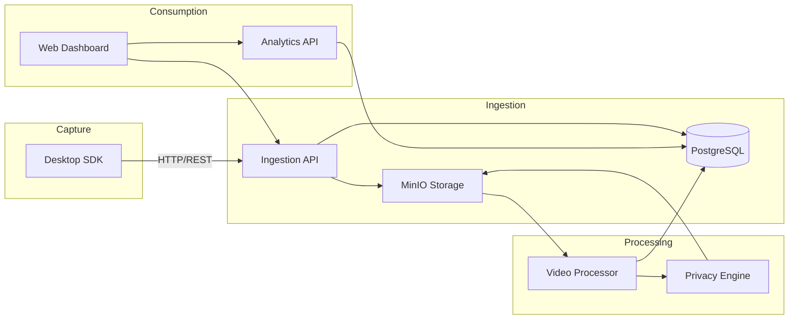
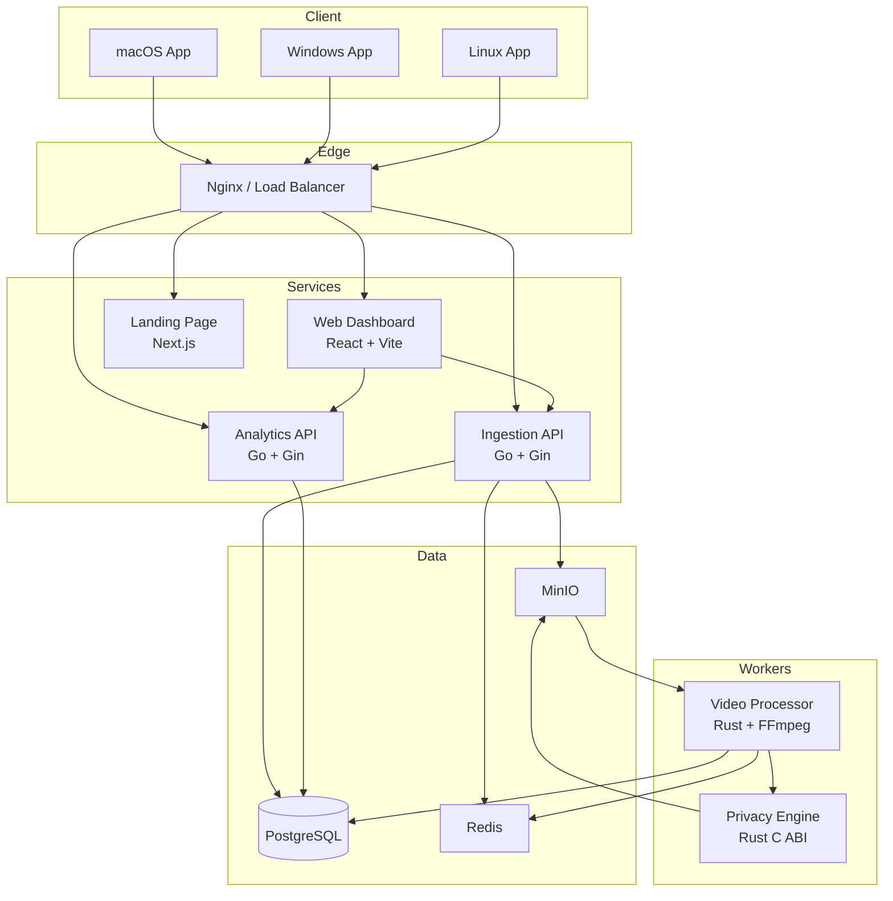
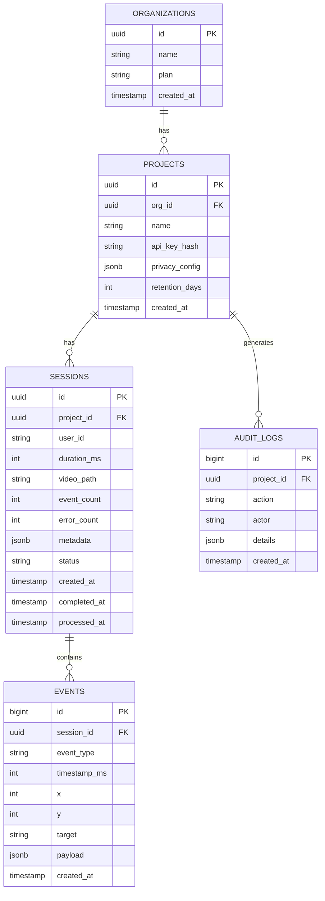
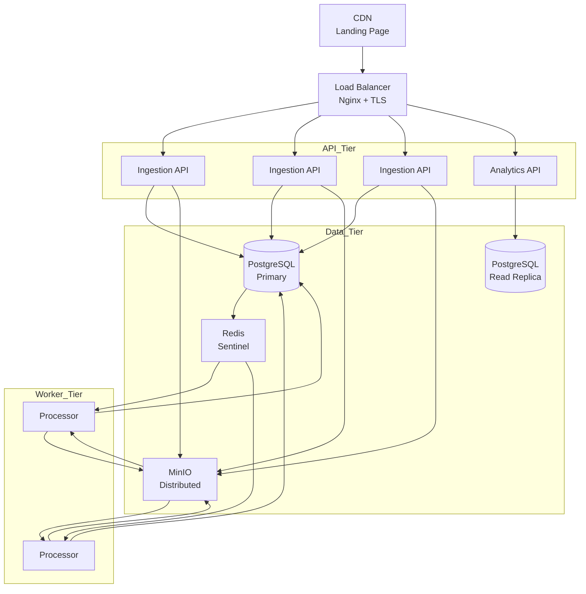

# Chronoscope Architecture

This document describes the high-level design, data flow, component interactions, and security boundaries of the Chronoscope platform.

---

## System Overview

Chronoscope is a multi-service platform composed of:

1. **Capture SDKs** — embedded in desktop applications to record screen frames and user events.
2. **Ingestion API** — receives raw capture data, validates API keys, and stores metadata.
3. **Video Processor** — asynchronously processes video chunks (transcode, deduplicate, index).
4. **Analytics API** — serves aggregated metrics (heatmaps, funnels, session stats).
5. **Web Dashboard** — React-based UI for replaying sessions and exploring analytics.
6. **Privacy Engine** — Rust library for PII detection and frame redaction.
7. **Landing Page** — static Next.js site for marketing.

---

## Data Flow



### Capture Flow

1. The **SDK** (Swift / C++ / Rust) captures frames and events locally.
2. It buffers data and uploads it to the **Ingestion API** via HTTP/REST.
3. The API stores session metadata in **PostgreSQL** and raw video chunks in **MinIO**.
4. A message is pushed to **Redis** to notify the **Processor**.

### Processing Flow

1. The **Processor** (Rust) polls the Redis queue for new jobs.
2. It downloads chunks from MinIO, transcodes them with **FFmpeg**, and deduplicates frames using **perceptual hashing**.
3. The **Privacy Engine** detects and redacts PII in frames (blur, blackout, replace).
4. Processed videos and event indexes are uploaded back to MinIO.
5. PostgreSQL is updated with processed paths and durations.

### Replay Flow

1. The **Web Dashboard** queries the Ingestion API for session lists and details.
2. It fetches processed video segments from MinIO (via presigned URLs).
3. The Canvas-based player renders video with an overlaid event timeline.

### Analytics Flow

1. The **Analytics API** reads from PostgreSQL.
2. It pre-computes heatmaps, funnel stages, and session statistics.
3. The Web Dashboard visualizes these aggregates.

---

## Component Diagram



---

## Database Schema



### Indexes

- `idx_events_session` — fast event lookup per session
- `idx_sessions_project` — session list per project
- `idx_sessions_created` — time-range queries
- `idx_audit_logs_project` — audit queries per project
- `idx_audit_logs_created` — audit time-range queries

---

## API Contract Overview

### REST

The ingestion contract is defined in the Go handler source code under `services/ingestion/internal/handlers/` and `services/analytics/internal/handlers/`.

**Authentication**: All endpoints require the `X-API-Key` header. The key is hashed with SHA-256 before comparison against the `projects.api_key_hash` column.

### Protobuf

The capture schema is defined in [`protocols/capture-schema/session.proto`](../protocols/capture-schema/session.proto).

Messages:
- `FrameChunk` — video frame batch
- `Event` / `EventBatch` — user interaction events
- `SessionMetadata` — device and session context

---

## Deployment Topology (Production)



- **Ingestion API**: Horizontally scalable stateless Go containers.
- **Analytics API**: Read-only queries; scales independently.
- **Processor**: Long-running Rust workers consuming the Redis queue.
- **PostgreSQL**: Primary + read replicas recommended for analytics.
- **MinIO**: Distributed mode for high availability.

---

## Security Boundaries

```
+------------------+
| Public Internet  |
| (TLS terminated) |
+------------------+
         |
+------------------+
| DMZ / Edge       |
| - Nginx          |
| - CDN            |
+------------------+
         |
+------------------+
| Application      |
| - Ingestion API  |
| - Analytics API  |
| - Web Dashboard  |
+------------------+
         |
+------------------+
| Data (Private)   |
| - PostgreSQL     |
| - Redis          |
| - MinIO          |
+------------------+
         |
+------------------+
| Processing       |
| - Video Processor|
| - Privacy Engine |
+------------------+
```

### Trust Boundaries

1. **SDK to Ingestion API**: Authenticated via `X-API-Key`. TLS required in production.
2. **API to Database**: PostgreSQL and MinIO credentials stored as environment variables.
3. **Processor to Storage**: Processor uses IAM-style credentials with least-privilege bucket access.
4. **Dashboard to Video**: Video URLs are served via MinIO presigned URLs; no direct bucket access.

---

For deployment specifics, see [DEPLOYMENT.md](DEPLOYMENT.md).
For API usage examples, see [API.md](API.md).
For security details, see [SECURITY.md](SECURITY.md).
